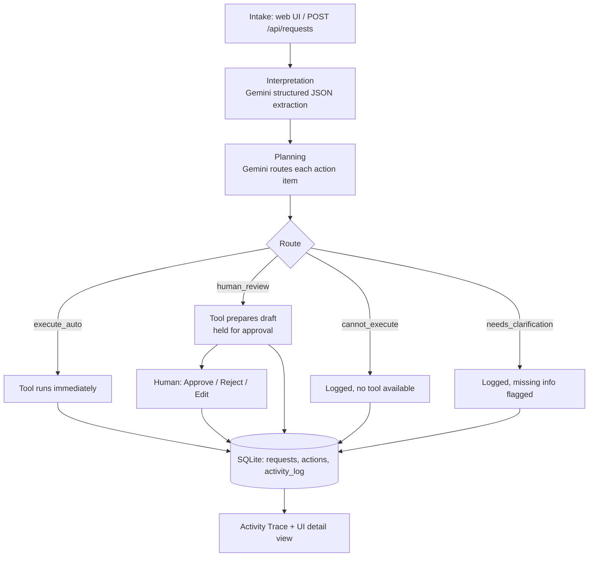

# Unstructured Work Agent

Turns unstructured incoming work — an email, meeting notes, a founder instruction, a
customer request, a bug report — into a structured, reviewable, partially automated
workflow, using an LLM for extraction and planning, real tools for execution, and an
explicit human approval gate before anything involving another person is considered done.

## What it does

1. **Intake** — paste raw text into a small web UI (or POST it via `curl`).
2. **Interpretation** — Gemini extracts a fixed JSON schema (title, summary, action
   items, priority, deadline, missing information, what could be automated, what needs
   a human) — never free-form prose.
3. **Planning** — Gemini routes every action item to one of four lanes: `execute_auto`,
   `human_review`, `cannot_execute`, `needs_clarification`, each with a stated reason and
   (if applicable) which tool handles it.
4. **Tool execution** — `execute_auto` actions run immediately; `human_review` actions
   get a draft prepared but are held for a person to Approve / Reject / Edit.
5. **Persistence** — everything is written to SQLite (original text, structured
   interpretation, plan, per-action tool inputs/outputs, approval status, timestamps).
6. **Activity trace** — a plain-English log of every step, visible in the UI without
   reading any code.

## Architecture



**Tools implemented** (`src/tools.js`):
| Tool | What it does |
|---|---|
| `draft_communication` | Drafts an email body — never sends it |
| `create_task_record` | Writes a task record to SQLite |
| `generate_markdown_brief` | Writes a `.md` summary to `data/briefs/` |
| `run_website_check` | Bounded, read-only HTTP check (status, timing, `<title>`, meta description) |
| `simulate_reminder` | Stores a reminder N days out — no real calendar |
| `search_stored_work` | Keyword search over previously stored requests |

## Agent workflow

`Intake → Interpretation → Planning → Tools → Approval → Persistence → Completion`

State passed between steps is minimal and explicit: `rawText → interpretation (JSON) →
plan (JSON array) → per-action tool results`, all persisted to SQLite after each step so
a crash mid-pipeline leaves an inspectable, honest record rather than silent loss.

## Setup

```bash
# 1. Clone
git clone <your-repo-url>
cd agent-app

# 2. Install
npm install

# 3. Configure — get a free Gemini API key (no credit card) at
#    https://aistudio.google.com/apikey
cp .env.example .env
# then edit .env and set GEMINI_API_KEY=...

# 4. Initialize the database (creates data/agent.db)
npm run init-db

# 5. Run
npm start
# -> Agent app listening on http://localhost:3000

# 6. Test (runs the 3 required scenarios; uses a mocked LLM automatically
#    if GEMINI_API_KEY is not set, so the pipeline can still be verified
#    without live network access)
npm test
```

Open `http://localhost:3000` in a browser, paste text into the Intake box, click
**Submit & Run Agent**, and watch the plan, tool outputs, and trace populate. Actions
routed to `human_review` show **Approve / Reject / Edit** buttons.

### Environment variables (`.env`, never commit this file)

```
GEMINI_API_KEY=your_gemini_api_key_here
GEMINI_MODEL=gemini-2.5-flash   # optional override
PORT=3000                        # optional override
```

## Test scenarios

`npm test` runs all three required scenarios and writes full evidence (interpretation,
plan, actions, activity trace) to `test/sample-outputs/scenario-{1,2,3}.json`.

- **Scenario 1 (routine business work)**: partner call notes → thank-you email drafted
  and held for approval, internal brief generated automatically, 7-day reminder set
  automatically.
- **Scenario 2 (website review)**: `hedamo.com` → a real, bounded HTTP check (status
  code, response time, title, meta description) plus a generated technical brief. The
  system only reports checks it actually ran — see `checks_not_performed` in the tool
  output for what it explicitly does *not* claim (SEO scoring, accessibility audit,
  security scan, performance audit, broken-link crawl).
- **Scenario 3 (ambiguous request)**: `"take care of the documentation and send it to
  everyone before the meeting"` → all three action items route to `needs_clarification`
  because the document, the recipient list, and the meeting are all unspecified — the
  system flags what's missing instead of inventing a document, a distribution list, or
  a date.

If `GEMINI_API_KEY` isn't set when `npm test` runs, the LLM layer is swapped for a
mock with realistic, schema-shaped responses so the rest of the pipeline — routing,
tool execution, SQLite persistence, approval gating, activity trace, failure
handling — is still exercised for real. This was necessary because the sandbox used to
build this had no outbound access to `generativelanguage.googleapis.com`; a normal
deployment has full internet access and Scenario 2 hits the real `hedamo.com` (during
development this returned a real HTTP 403, which the tool reported honestly rather than
faking a 200).

## Design decisions

- **Plain sequential pipeline, no agent framework.** `pipeline.js` is ~150 lines of
  readable async functions. Given the 3–5 hour scope, a framework (LangGraph, CrewAI)
  would add indirection without adding capability — a simple implementation I fully
  understand beats a complex one I'd have to explain by pointing at library internals.
- **Schema-constrained JSON output**, not prompt-and-hope: both LLM calls use Gemini's
  `responseSchema` so the model literally cannot return prose where structured data is
  required. A second layer of defensive validation (`validateInterpretation`) checks the
  parsed result makes sense, because a schema guarantees shape, not correctness.
- **`human_review` actions are prepared, not executed.** The tool runs and produces a
  draft, but the action is only "done" after an explicit Approve / Reject / Edit —
  satisfying the human-in-the-loop requirement without faking automation.
- **Tools report failure explicitly** (`{ ok: false, error }`) instead of throwing or
  silently returning partial data, so the pipeline can log honest failures rather than
  pretend success.
- **SQLite via better-sqlite3** (synchronous, no callback/promise wrapper needed) — fine
  for a single-process prototype; not a production data layer.

## Limitations

- No real email is ever sent, no real calendar event is created — this is explicit in
  the assignment and enforced in code (`draft_communication` and `simulate_reminder`
  never touch external services).
- The website check is intentionally shallow (status/timing/title/meta only) — it does
  not do SEO, accessibility, security, or performance auditing, and says so in its own
  output.
- No auth/multi-user support — this is a single-operator prototype.
- The pipeline runs synchronously within the HTTP request; a large batch of long-running
  tool calls would need to move to a background job queue.
- Gemini's free tier has modest per-minute/per-day rate limits — fine for this prototype,
  not for production volume.

## What I'd build next

1. Background job queue (e.g. BullMQ) so intake returns immediately and long tool runs
   don't block the HTTP request.
2. Real integrations behind the same tool interface (e.g. actually send via a sandboxed
   email provider once a human approves, actually create a calendar event) — the
   approval gate is already there, ready for a "real" send/create action.
3. Multi-user auth so `human_review` items can be assigned and approved by different
   people than the submitter.
4. Streaming the activity trace over WebSockets instead of polling on selection.
5. A richer website-check tool (basic accessibility and broken-link checks) while still
   being explicit about what it does and doesn't cover.

## How I used AI

- **Tools used**: Claude (via this chat) for the overall design, all source code, and
  this README.
- **What I used it for**: scaffolding the Express/SQLite/Gemini architecture, writing
  the structured-output schemas, the routing/planning logic, the approval state machine,
  and the vanilla-JS frontend.
- **One example of an AI mistake**: the first draft of the website-check tool used
  Node's built-in `fetch` without a timeout, so a hanging/unreachable host would have
  stalled the whole pipeline indefinitely.
- **How I identified and fixed it**: caught it during a design review of the failure-
  handling requirement (the assignment explicitly asks for "the system should fail
  clearly rather than pretending to succeed") — an unbounded hang isn't a clear failure,
  it's silent unresponsiveness. Fixed by adding `signal: AbortSignal.timeout(8000)` and
  wrapping the fetch in try/catch that returns `{ ok: false, error }` with a specific
  timeout message, which was then verified in `test/test-pipeline.js`.
